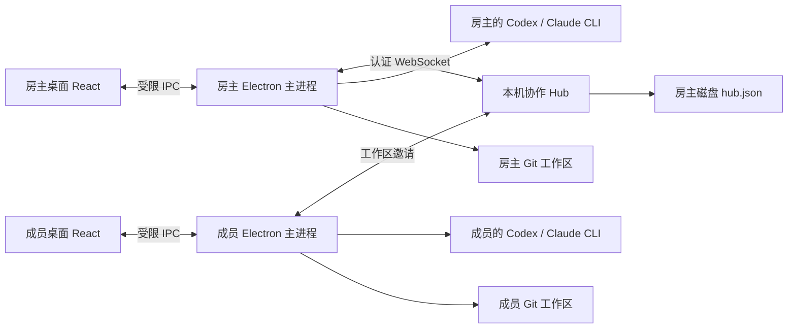

# 架构

## 权限与数据流

渲染进程不启用 Node.js；contextIsolation 和 sandbox 开启。preload 只暴露 `invoke` 与事件订阅。主进程检查消息来源是主窗口的主 frame，并按固定方法表路由。

Hub 默认只监听 loopback。只有房主在界面开启共享才绑定 `0.0.0.0`。WebSocket 拒绝带有浏览器 Origin 的请求，认证有 5 秒期限，单帧有大小上限。主机密钥、邀请密钥随机生成，常量时间比较。邀请限定工作区，失效或撤销后不能加入。

每台客户端保存随机身份 secret；Hub 用它的 SHA-256 摘要形成 owner ID。请求体不能替换 owner ID。所有会话、记忆和审批操作检查工作区边界；仅通道所有者能领取执行、写入 Agent 事件和发布通道 diff。房间成员可提出停止请求。每次执行使用 run ID 防止过期事件混入新执行。

`pending → approved → claimed` 的变化在单个 Node.js 事件循环里同步执行并原子写盘，避免两个领取者重复发起同一任务。若执行在未知状态下断开，不自动重试。

审批不传递提供商凭据。获批事件同步后，只有对应 owner 的 Electron 主进程会调用自己的本地 CLI。stdout JSONL 规范化为共享 transcript；UI 不执行模型输出或 HTML。

共享状态不包含本机绝对路径和 CLI 身份凭据。目录映射留在成员自己的 client.json。成员要编辑 / 运行前必须关联本机目录。文件 API 防止 `..`、符号链接越界和 `.git` 内部读写，并用内容 hash 检查外部修改。

## 目录

- `core/hub.mjs`：房间状态、认证、作用域、审批、持久化、广播。
- `core/client.mjs`：WebSocket RPC、状态订阅、连接恢复。
- `core/local.mjs`：Git / 文件边界 / CLI 适配和进程生命周期。
- `core/standalone.mjs`：独立协调服务入口。
- `desktop/main.mjs`：桌面生命周期、本机目录、共享连接、执行调度。
- `desktop/preload.cjs`：隔离 IPC 桥。
- `src/main.tsx`：中文任务大厅、共享会话、多通道、审批、编辑器、记忆等。
- `tests/`：跨客户端协作与本地执行边界测试。

## 有意识的实现边界

当前以本机 / 小型可信团队为目标，使用 JSON 原子替换持久化和完整快照广播。大规模团队需要增量事件协议、数据库、背压、保留策略、成员角色和 TLS。客户端断连不会触发任何自动代码合并。源码同步应交给 Git；共享 diff 是供协作者审阅的视图。

## v0.2 账号与公网扩展

`core/accounts.mjs` 在本机运行官方 CLI 登录与状态查询。主进程只把必要账号状态和经过隐藏处理的登录输出传给自己的渲染进程；这些字段不进入 Hub 快照。GitHub 使用 gh 的授权与 Git 凭据助手，不创建自有 OAuth 密钥。GitHub 仓库访问授权与协作邀请是独立权限。

`core/installers.mjs` 安装 Apple Silicon / Intel 官方 CLI。Codex、gh、cloudflared 读取各自 GitHub 官方 release 的 asset digest，校验 SHA-256 后再解包。可执行文件保存在用户数据目录的 bin 中；Claude 运行 Anthropic 的官方本机安装程序。没有管理员权限安装或修改系统 PATH。

`core/tunnel.mjs` 启动 cloudflared，将临时 HTTPS/WSS 公网端点转到已有 loopback Hub。地址与 tunnel 注册均成功才生成邀请。关闭应用时终止隧道。此链路在 Cloudflare 处终止 TLS，不是端到端加密；适合同事 beta，不提供云端常驻和可用性承诺。邀请仍是随机 256-bit、工作区限定、24 小时有效且可即时撤销。

远程身份使用本机身份密钥和目标端点派生，每个服务器得到不同身份值。不同临时域名之间不保证通道所有权自动迁移。Hub 设置连接数和消息频率上限，未认证请求失败即关闭；客户端对异常 JSON 响应关闭连接而非崩溃。
