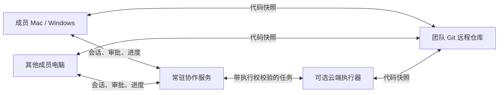

# 房主离线后的协作与执行

讨论记录：用户选择同时需要（1）同事继续协作、各自在本机执行，（2）任务能够由云端接续。此文件是架构方案，不表示已部署托管服务或购买云资源。

## 两层能力

协作服务持久保存房间、身份、角色、计划、评论、转录与执行状态，保持实时连接。执行器运行 Provider 与项目，可位于成员电脑或独立云端机器。协作服务不能单独替代执行电脑。

## 建议产品行为

- 运行位置：本机 / 云端。房间成员能看到谁的账号、哪台机器、当前任务及待审批动作。
- 离线后：暂停 / 转交。云端执行需独立完成 Provider 与 GitHub 授权，不复制成员电脑上的长期凭据。
- 主机离线时房间继续存在，同事可查看、评论、开自己的 Agent，并按最近确认的代码与计划接手。
- 主动交接：先停止旧执行，上传快照与检查点，确认接收者已经同步，再授予新执行权。
- 被动断线：界面显示最新检查点时间及未确认动作。云端不能假装知道本机最后几秒发生了什么。

## 必须处理的冲突

「断网后本机继续执行」与「云端自动无条件接管」不能同时保证只有一个执行者。网络分区时两边可能都认为自己拥有任务。

需要明确策略：普通独立编辑可在各自分支继续；对部署、推送、发消息等有副作用的动作，执行器必须持有仍有效的执行租约，并在动作入口验证。租约到期则暂停该类动作。旧执行未确认停止、动作结果未知时，不自动重试；先读取外部系统证据或由人确认。

代码快照和上下文接力可以跨机器，不能承诺任意 Provider 内部进程或登录 session 无缝迁移。新执行使用接收者的账号和明确可恢复的状态。

## 实现顺序

1. 把现有 Hub 的持久化、身份和连接层独立部署，客户端支持固定地址；完成备份、迁移和访问控制。
2. 先确保任意成员退出不影响其他成员和房间历史，不增加云端执行费用。
3. 增加显式注册的执行器、环境准备、密钥隔离、执行租约与任务检查点。
4. 开启本机到云端的主动转交；验证成功后再提供失联时的受控接管。

待决定：团队自托管还是由产品托管、现有服务器与域名、数据所在区域、云端执行额度及停机策略。这些选择不阻碍当前本地功能的开发。
