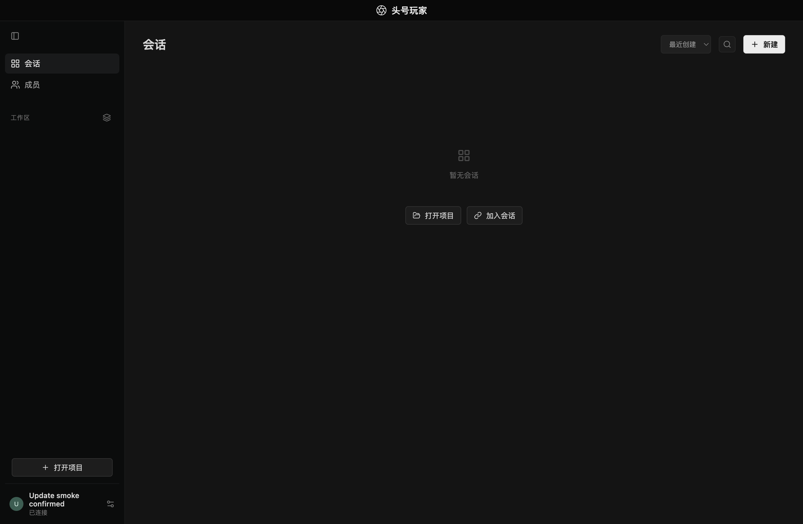
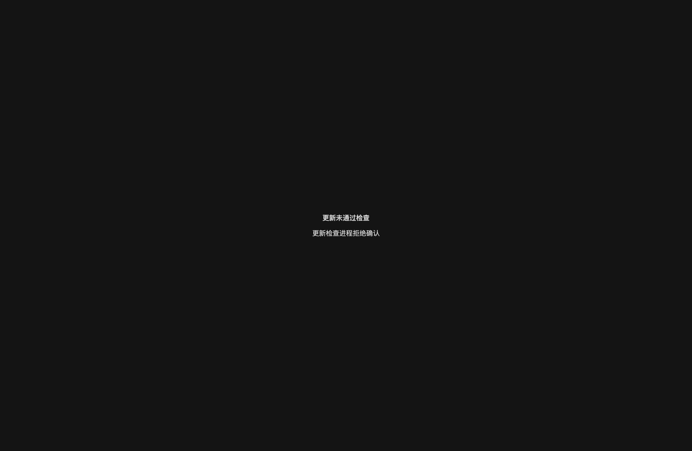

# Electron 更新健康门禁 · 实际桌面验证

2026-09-24，macOS arm64，0.4.5-beta.1：确认与拒绝两种场景 **2/2 通过**。测试入口是 `scripts/update-health-desktop-smoke.mjs`，通过动态 import 加载实际 `desktop/main.mjs`，没有复刻主进程 IPC 或 React 界面。

## 复跑

```sh
npm run build
node scripts/update-health-desktop-smoke.mjs
```

脚本输出独立临时目录中的 `summary.json` 路径。每个场景保留 `desktop.json`、`protocol.json`、Electron 日志和 checking/final PNG，只有测试自己启动的 Electron 实例退出。

Node 驱动生成独立 launcher package，使 `app.getVersion()` 等于仓库版本；票据 target 为当前安装依赖中的真实 `node_modules/electron/dist/Electron.app`，使用 realpath 与整包摘要。票据绑定临时数据目录、版本、摘要、进程 PID、随机 challenge 和 loopback HMAC。Node 的认证 HTTP fixture 扮演更新工作进程，稳定阶段至少等 500ms，并等 Electron 完成 checking 门禁断言后才允许继续。

`RPO_DATA_DIR` 为含中文 / 空格的全新临时目录，Electron userData 也在其中。账号自动刷新仅遇到隔离 bin 中退出码 1 的模拟 codex/claude/gh/cloudflared，不执行真实 CLI 或请求外部模型。没有替换 app 包，也没有触碰 `/Applications`、`~/Applications` 或用户正常数据。

## 实际断言

- 真实 React `data-update-verification` 页面已挂载；DOM marker 与主进程 bootstrap nonce 一致，错误 nonce 被拒绝，renderer 不暴露 Node。
- `RPO_UPDATE_HEALTH_TICKET` 在实际 main 导入后已删除，并遍历确认整个 `process.env` 不再含原 token 或编码票据。
- 确认前从真实 preload 执行 `window.rpo.invoke`：`settings.name`、`terminal.open`、`updates.install` 均被更新门禁拒绝，本机名字未改变。
- **确认模式**：服务端验证 loaded / stable 两份 HMAC、不同 challenge、实际 child PID、版本、摘要、数据目录、dataLoaded / rendererReady；写入 PID 绑定签名 receipt，真实主界面解锁。此后 `settings.name` 确实成功，画面显示测试名字。
- **拒绝模式**：loaded 后 stable challenge 被服务端拒绝。实际界面显示“更新未通过检查”，三种 IPC 再次被拒绝，`client.json.enc` 与检查前逐字节相同，正常主界面没有挂载。
- 两个实例通过实际 app.quit 生命周期退出；依赖 Electron.app 的整包摘要测试前后相同。

[结构化证据](evidence/update-health-desktop-0.4.5/summary.json)

| 检查中 | 确认后 | 拒绝后 |
| --- | --- | --- |
|  |  |  |

## 本测试实际发现的修复

初次真实运行中，UI / IPC 门禁断言通过，但在发送第一个 challenge 前出现“应用文件正在改变”。诊断定位到 Electron 的 ASAR 虚拟文件系统：读取 `default_app.asar` 内部文件时，两次 `lstat` 的虚拟 inode 自增，例如 preload.js 从 28 变 29，styles.css 从 30 变 31，导致 bundleDigest 误报并永久保持门禁。

主实现随后改用 Electron `original-fs` 读取真实磁盘；没有设置全局 `process.noAsar`。本记录的成功结果是在该修复后重新启动实际 main 获得的。失败记录保留于本机临时证据，不混入通过统计。

## 边界

此脚本证明实际 Electron main / preload / React 的健康确认门禁和 HMAC 协议接线，服务端是本机 fixture。它不执行 UpdateService 安装、不替换应用、不下载发布资产，也不宣称验证了已签名发行包升级或真实旧版本回滚。更新工作进程的真实目录替换与回滚由独立 `tests/update-health.test.mjs` 等测试负责；本脚本不替代那些证据。Windows 自更新和 GUI 登录也不属于本测试。
