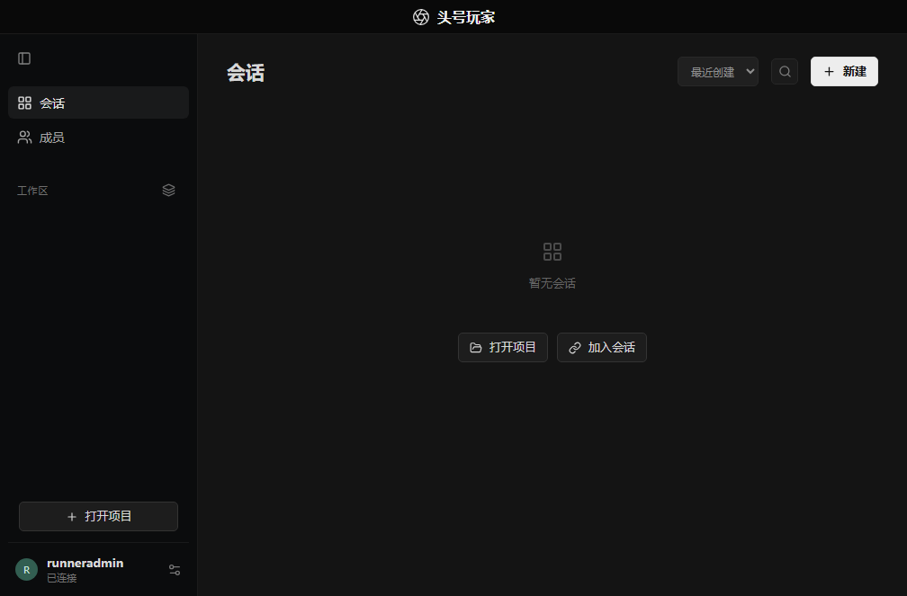

# Windows 原生 CI 验证

工作流：`.github/workflows/windows-native.yml`。运行环境为 GitHub Actions `windows-2022` x64 虚拟机，源码基线为 `bf0039e`（0.4.1-beta.1 发布后的文档提交）。不覆盖 GitHub Releases 资产。

验证脚本 `scripts/windows-native-smoke.mjs` 使用安装的 Electron 原生 Windows 可执行文件，导入实际 `desktop/main.mjs`，启动本地 Hub、系统加密密钥、preload 与 React 界面。所有数据写入 runner 临时目录 `RPO 原生测试 data`，有意包含中文和空格。脚本检查实际界面控件、禁止 renderer Node、preload bridge，并保存桌面截图。

同一 Electron 进程加载实际 `node-pty` 二进制，通过真实 PowerShell 会话检查输入输出、控制台 TTY、尺寸变化、Ctrl-C、退出码以及窗口所有者清理。匹配的输出标记在命令中拆分，避免仅匹配输入回显造成假通过。成功退出走应用自身的异步 `before-quit` 清理，测试超时或失败使用非零退出码。

工作流先运行 24 项平台、账号边界、图片、加密草稿和断线补传回归，之后进行上述桌面验证，再构建 unsigned x64 ZIP / NSIS。仅将日志、JSON、截图和 SHA256 上传为 Actions artifacts；测试安装包保留 7 天。

## 2026-09-24 实际结果

[Windows native verification #4](https://github.com/ebrahimeolakey/ready-player-one/actions/runs/35973983566) **success**，验证源码 `7e0dcf3ff7cb28e4fb40db05a5b4104f66f8cd86`。24/24 回归通过，真实 Electron / PTY 冒烟通过，ZIP / NSIS 均构建完成。未修改已发布安装包。

运行时为 Electron **40.10.6**、Node **24.15.0**、win32 x64；实际渲染 10 个按钮，本地 Hub 已连接。终端记录包含 `RPO_PTY_OK`、`RPO_TTY_True`、`RPO_SIZE_109_37`、`RPO_INTERRUPTED`，随后正常退出码为 7；第二个终端由 closeOwner 关闭后确认 PowerShell PID 不再存在。应用正常走自身退出流程，日志包含 `WINDOWS_NATIVE_SMOKE_OK`。

[运行证据 artifact](https://github.com/ebrahimeolakey/ready-player-one/actions/runs/35973983566/artifacts/10796704871) 包含截图、运行时 JSON、终端输出和完整 stdout/stderr；[独立测试包 artifact](https://github.com/ebrahimeolakey/ready-player-one/actions/runs/35973983566/artifacts/10797800699) 包含本次构建文件（需要登录 GitHub，保留 7 天）。这些是 CI 测试包，不是 Releases 已发布资产。

| 文件 | 本次 CI 的 SHA256 |
| --- | --- |
| `Ready-Player-One-0.4.1-beta.1-windows-x64-setup.exe` | `3285d49bd63a8de39570e2e5e0d84b61ef9ba539a4ad0e4a0aa53d416d9541e6` |
| `Ready-Player-One-0.4.1-beta.1-windows-x64.zip` | `1a0f13ab2ea5e6ae34ebd49bcea1cf28c3c093ca397aaa5d3f8ffe778b27f65f` |

本轮只修正验证本身：macOS 下载资产单测显式选择 darwin；Electron 测试入口不使用顶层 await app.whenReady，以免阻塞入口加载。不包含产品逻辑更改。

## 仍需同事验收

- GitHub Actions 虚拟机不等于 Windows 10/11 实体电脑兼容矩阵。
- 未用真实账号完成 Codex / Claude / GitHub 的交互登录，未调用付费模型。
- 未验证跨公网两台实体电脑的完整协作流程。
- ZIP / NSIS 构建通过不等于安装向导、SmartScreen、卸载或自更新闭环通过。
- 此分支基于已发布 0.4.1 源码，不包含主工作区此后未提交的群聊改动。

## 0.4.2-beta.1 原生验证

[成功运行](https://github.com/ebrahimeolakey/ready-player-one/actions/runs/35976364396)，准确源码提交 `c5f2c4abdaa28b4ad4bfc9b48728791cb05a27c2`。

- Windows 2022 x64：**27/27 回归通过**，Renderer 构建通过。
- Electron 40.10.6 真正启动主入口、Hub、加密设置、preload 与 React；真实 PowerShell PTY 输入输出、TTY、109×37 resize、Ctrl-C、退出码及进程清理通过。
- ZIP / NSIS 原生构建成功；下载后的 SHA256 与 runner 一致。
- 包内 51 个 core/desktop 源文件与发行源码比较，仅 Windows CRLF / LF 行结束符不同；编译后的 JS/CSS 一致。未混入另一批群聊与项目上下文开发。

仍未覆盖实体 Windows 首次安装、SmartScreen/安装向导、真实账号 GUI 登录、全部 Provider 及两台实体机器公网流程。

## 0.4.3-beta.1 原生验证

[成功运行](https://github.com/ebrahimeolakey/ready-player-one/actions/runs/35978675952)，准确源码提交 `2314066ab13f28d332a2f188edc40a67b89c66d8`。

Windows 2022 x64：**28/28 回归通过**，Renderer 构建、实际 Electron 40.10.6 主入口/Hub/加密设置、真实 PowerShell PTY 的输入输出/尺寸/Ctrl-C/退出清理全部通过。ZIP 与 NSIS 在同一 runner 构建成功。

本批本机完整源码回归 277/277；Windows 使用现有平台回归清单，没有把全部 277 项在 Windows 重跑。实体机器首次安装、真实账号登录和双机公网仍需同事验收。

下载后已核对 runner SHA256；Windows ASAR 内 59 个 core/desktop/dist 文件与发行源码一致（仅允许 CRLF/LF 差异）。ZIP 完整性通过。本轮安装器 SHA256 `155266ff231e20747051ee87379cd07ee7c19dcf1907bfeceb7501a390e8c3f4`；便携 ZIP SHA256 `0b2d5f304919f8f406a896664750c61e97dece77881ef1ab2329f2d61ec8cad0`。

## 0.4.4-beta.1 原生验证

[成功运行](https://github.com/ebrahimeolakey/ready-player-one/actions/runs/35982061256)，源码提交 `b740399dde53d579d3b6d6151006cb2bdc95499f`。

Windows 2022 x64 的现有平台回归 **28/28 通过**；实际 Electron 40.10.6 主入口、Hub、加密设置、React、PowerShell PTY 全部通过。新增 Provider CLI 检查用 runner 的 console Node 22.23.2 在真实 ConPTY 中验证中文/空格/引号/元字符参数、TTY、规范目录、本人权限、Shift+Tab 原字节、重复打开不重发、退出码和清理。没有调用真实 Codex/Claude 模型或登录账号。

第一次新增实验使用 Electron GUI 程序作为 console fixture，未成功就绪；改为经过 PE console subsystem 验证的真实 node.exe 后，保持相同断言通过。该修复只修改测试入口，未放宽应用权限或终端逻辑。

ZIP/NSIS 在同一 runner 构建成功，下载后的 SHA256 与 runner 一致；ZIP 完整性通过。ASAR 中 71 个 core/desktop/dist 文件与发行源码一致（仅归一化 CRLF/LF）；ASAR SHA256 `2d751839b163ace1345628ae22f805d7820f2c66b5f888e4ef26176a822a4077`。

- 安装器：`5bc5d066fe8a6a6e345e6c83db1d71a4e2e40d0150cf1135b53176e07070098a`
- 便携 ZIP：`28cde531567c09ca6e57121f92456ffbfe56d941d39766b79effd060b523bf2a`

本机完整回归 319/319，并非全部 319 项都在 Windows 重跑。实体 Windows 首次安装、真实账号 GUI 登录与双机公网仍需同事验收。

## 0.4.5-beta.1 原生验证

[最终成功运行](https://github.com/ebrahimeolakey/ready-player-one/actions/runs/35985376144)，精确源码提交 `f0e644af873a7f928efa63b05647bf9881d7eb88`，包含发布前的新建 GitHub 仓库表单样式修复。此前 `b766b99` 的成功运行仅保留为过程证据，不作为最终发行包。

Windows 2022 x64 的现有平台回归 **28/28 通过**；Renderer 构建、实际 Electron 40.10.6 / Node 24.15.0 主入口、Hub、加密设置、preload / React 和真实 PowerShell PTY 均通过。Provider CLI 使用 console Node 22.23.2 在真实 ConPTY 中验证中文 / 空格 / 引号 / 元字符参数、TTY、目录、权限、Shift+Tab、重复打开不重发、退出码与清理，未调用真实模型。

ZIP 与 NSIS 在同一 runner 构建成功，下载后的 SHA256 与 runner 一致，ZIP 全部 CRC 校验通过。ASAR 内 **78 个 core/desktop/dist 文件**与隔离发行源码文件清单完全相同：76 个仅 CRLF/LF 不同，编译 JS/CSS 两个文件逐字节一致；没有额外或缺失文件。manifest 为 `0.4.5-beta.1` / Apache-2.0；ASAR SHA256 `13b623e1981f356110c3f830a3b18d654934d8988e529b5c1c59ab36be66a2d2`。

| 文件 | SHA256 |
| --- | --- |
| `Ready-Player-One-0.4.5-beta.1-windows-x64-setup.exe` | `8653920dc7b79aeb4d0196dd98991775403fad6f00de70275d1973f6fb671795` |
| `Ready-Player-One-0.4.5-beta.1-windows-x64.zip` | `5eb3a2dac692cbcc4878bdb623d87fe82d527dcb7c0df7aba35c3bb30736b2b8` |

[结构化审计](evidence/windows-native-0.4.5.json)；[运行证据 artifact](https://github.com/ebrahimeolakey/ready-player-one/actions/runs/35985376144/artifacts/10801847150)；[原生构建包 artifact](https://github.com/ebrahimeolakey/ready-player-one/actions/runs/35985376144/artifacts/10801842208)。artifact 有保留期，最终下载请使用项目 Releases。

本机隔离完整回归 361/361；并非全部 361 项在 Windows 重跑。此证据不覆盖实体 Windows 首次安装、SmartScreen / 安装向导、真实账号 GUI 登录、Windows 自更新或两台实体机器的公网协作；macOS 更新健康门禁验证另见 [实际桌面记录](UPDATE-HEALTH-DESKTOP-SMOKE.md)。

## 0.4.6-beta.1 原生验证

[最终成功运行](https://github.com/ebrahimeolakey/ready-player-one/actions/runs/35987512860)，精确提交 `65b0439f7cc6cb0bf944753fcbfd196d8924d3da`。

Windows 2022 x64 的现有平台回归 **28/28 通过**；实际 Electron 40.10.6 / Node 24.15.0 主入口、Hub、preload / React、PowerShell PTY 与 Provider CLI ConPTY 检查通过。真实 IPC 保存通用偏好后，新建 SecureStore 使用 safeStorage 解包密钥读回一致；非法输入被拒绝且加密文件字节不变。实际界面由编辑器布局 / 紧凑对话切换到 Agent 布局 / 详细对话，并检查空编辑器高度为 0。验证中通知、声音、托盘均关闭，没有真实账号或模型调用。

[首轮运行](https://github.com/ebrahimeolakey/ready-player-one/actions/runs/35987154236) 的通用偏好检查通过，但 PowerShell 首次命令未产生输出，记录只有随后出现的初始提示符。测试入口增加等待真实 PowerShell 提示符后再输入命令；其余 TTY、resize、Ctrl-C、退出码、权限和清理断言不变。最终运行通过。这是测试就绪时序修正，不代表修复或完整验证了产品在 shell 启动前处理输入的行为。

ZIP / NSIS 在同一 runner 构建成功，下载后的 SHA256 与 runner 一致，ZIP 全部 CRC 通过。包内 **81 个 core/desktop/dist 文件**与隔离发行目录完全同清单：79 个仅 CRLF/LF 不同，编译 JS/CSS 两个文件逐字节相同。隔离目录的 128 个 core/desktop/src/package 文件另与精确提交逐字节核对一致，未混入主工作区的群聊与项目上下文改动。manifest 为 `0.4.6-beta.1` / Apache-2.0；ASAR SHA256 `a6fe58563cad4d17c7a214989a5ab030091c28b3491748959717731c4f4ef82a`。

| 文件 | 字节数 | SHA256 |
| --- | ---: | --- |
| `Ready-Player-One-0.4.6-beta.1-windows-x64-setup.exe` | 104946640 | `477df93488898377f8bd9610509abbeb43c1126501f5476223233a9213e4e05f` |
| `Ready-Player-One-0.4.6-beta.1-windows-x64.zip` | 147974446 | `e20741d45f4ea2ccb6295241a4c00cd662e6c0ea60caaf972f8691f33210bd53` |

[结构化审计](evidence/windows-native-0.4.6.json)；[运行证据 artifact](https://github.com/ebrahimeolakey/ready-player-one/actions/runs/35987512860/artifacts/10802549188)；[原生构建包 artifact](https://github.com/ebrahimeolakey/ready-player-one/actions/runs/35987512860/artifacts/10803335431)。artifact 有保留期，最终下载请使用项目 Releases。

[通用偏好合成会话截图](evidence/windows-native-0.4.6-preferences.png)。布局与隐藏状态以结构化证据中的实际 DOM / CSS 断言为准。

本机完整回归 375/375，并非全部 375 项都在 Windows 重跑。仍未覆盖实体 Windows 首次安装、SmartScreen / 安装向导、真实账号 GUI 登录、实际 Windows 通知 / 托盘 / 声音、Windows 自更新或两台实体机器的公网协作。

## 0.4.7-beta.1 验证准备（尚未运行 Windows CI）

既有 workflow 保持不变。`scripts/windows-native-smoke.mjs` 保留 PowerShell 初始提示符等待和全部 PTY / Provider CLI 断言，新增以下原生验证入口：

- 使用已验证为 console PE 的 runner `node.exe` 执行 `tests/vscode-import.test.mjs` 与 `tests/vscode-import-controller.test.mjs`。TAP 的总数、通过、失败和跳过数写入 `windows-native.json.additionalRegressions`；要求全部通过、无跳过。它们是原 28 项平台清单之外的新增测试，不能将本机测试结果充当 Windows 结果。
- 顺序启动 `scripts/windows-appearance-smoke.mjs` 的 `save` 与 `restart` 两个真实 Electron 进程，使用同一个新增临时数据目录，与外层烟测数据隔离。保存阶段检查真实暗 / 亮主题 CSS 和彩色 / 单色头像；确认首进程实际退出后，第二进程在任何写入前检查主进程从加密磁盘恢复的设置及实际页面样式，再恢复彩色头像与暗色主题对照最初配色。
- 只通过应用原有 preload / main IPC 保存设置；无 mock renderer。通知、声音与托盘关闭，不发起模型调用。日志、分阶段 JSON 和截图写入 `ci-evidence/appearance/` 及 `windows-appearance-*.log`，沿用已有 evidence artifact 上传。

新增子进程分别限时 45 秒，整套烟测上限由 120 秒调整到 180 秒以容纳两次实际应用启动；PowerShell 与既有各行为断言不放宽。本机导入模块 22/22 通过及脚本语法检查仅是提交前准备；最终 Windows 结果须在精确集成提交触发 CI 后补充。
